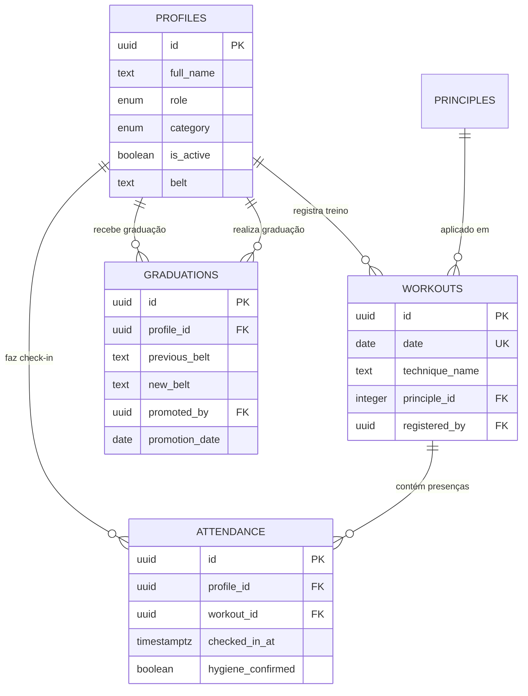

# Sprint Zero — Artifact 1: Domain Analysis & Strategy (Premium Edition)

**Project:** JJCAC (Jiu-Jitsu CAC — "Jiu-Jitsu para Todos")
**Responsible Agent:** `Architect_TRM`
**Input:** `jiujitsucac.md` + `stitch_social_management_premium_app` (Premium Design) + `Os32Principios.pdf`
**Sprint Zero Profile:** PREMIUM ADAPTATION
**Date:** 2026-05-25

---

## 1. PROJECT CONTEXT

### 1.1 Project Name
**JJCAC Premium** — Plataforma de Gestão para o Projeto Social "Jiu-Jitsu para Todos"

### 1.2 Industry / Sector
Gestão Esportiva — Projetos Sociais — Educação Física e Extensão Universitária

### 1.3 Target Audience
- **Mestre Sadi Seabra (Coordenador):** Administrador do projeto social, responsável por gerir alunos, monitores, presenças, relatórios de prestação de contas e promoções de faixa.
- **Alunos do tatame:** Praticantes de Jiu-Jitsu (diversas idades), incluindo bolsistas da UFPE/FICR que acumulam carga horária de extensão.
- **Monitores (Alunos promovidos):** Praticantes avançados promovidos pelo Mestre que auxiliam na administração (check-in via scanner, registro de treinos).

### 1.4 Problem It Solves
O projeto social "Jiu-Jitsu para Todos" opera com gestão manual e fragmentada:
- Controle de presença em papel ou planilhas;
- Sem rastreabilidade de progresso dos alunos por faixa e histórico de graduações;
- Impossibilidade de gerar relatórios formatados para prestação de contas institucionais (UFPE/FICR);
- Nenhum reforço ético-pedagógico sistemático (os 32 Princípios do Jiu-Jitsu);
- Formulários legados do Google Forms sem integração com banco central.

### 1.5 Unique Value Proposition
Uma PWA Mobile-First com design **Dark Premium** que transforma o tatame em um ambiente de gestão digital: check-in via QR Code com validação de higiene (Ecologia Integral), reforço ético diário (Princípio do Dia), gestão de graduações e painel analítico que segmenta alunos (Frequentes, Acadêmicos, Visitantes) para exportação de relatórios de prestação de contas — tudo rodando no celular do aluno, sem necessidade de app store.

---

## 2. ENTITY MAP (Domain Model)

### 2.1 Entities and Key Attributes

#### Entity: Profile (Perfil do Usuário)
| Attribute | Type | Notes |
|:---|:---|:---|
| `id` | uuid (FK → auth.users) | Vinculado ao Supabase Auth |
| `full_name` | text | Nome completo |
| `email` | text | Único, validado |
| `role` | enum(`admin`, `monitor`, `aluno`) | Define permissões (RBAC) |
| `belt` | text | Faixa atual do praticante |
| `category` | enum(`frequente`, `academico`, `visitante`) | Segmentação para relatórios |
| `institution` | text (nullable) | UFPE, FICR, etc. (para acadêmicos) |
| `enrollment_id` | text (nullable) | Matrícula institucional (para acadêmicos) |
| `is_active` | boolean | Toggle de Ativar/Bloquear pelo Admin |
| `created_at` | timestamptz | Auditoria |
| `updated_at` | timestamptz | Auditoria |

#### Entity: Principle (Os 32 Princípios do Jiu-Jitsu)
| Attribute | Type | Notes |
|:---|:---|:---|
| `id` | serial | Identificador sequencial (1-32) |
| `number` | integer | Número do princípio (1 a 32) |
| `title_pt` | text | Título em Português |
| `title_en` | text | Título em Inglês (original Rener Gracie) |
| `description` | text | Explicação do princípio |
| `category` | text | Agrupamento temático (ex: "Defesa", "Ataque", "Filosofia") |

#### Entity: Workout (Treino do Dia)
| Attribute | Type | Notes |
|:---|:---|:---|
| `id` | uuid | PK |
| `date` | date | Data do treino (unique por dia) |
| `technique_name` | text | Nome da técnica ensinada |
| `technique_what` | text | Shading: O que se faz |
| `technique_how` | text | Shading: Como se faz |
| `technique_why` | text | Shading: Por que se faz |
| `principle_id` | integer (FK → principles) | Princípio aplicado neste treino |
| `registered_by` | uuid (FK → profiles) | Monitor ou Admin que registrou |
| `created_at` | timestamptz | Auditoria |
| `updated_at` | timestamptz | Auditoria |

#### Entity: Attendance (Registro de Presença / Check-in)
| Attribute | Type | Notes |
|:---|:---|:---|
| `id` | uuid | PK |
| `profile_id` | uuid (FK → profiles) | Aluno que fez check-in |
| `workout_id` | uuid (FK → workouts) | Treino vinculado à data |
| `checked_in_at` | timestamptz | Momento exato do check-in |
| `hygiene_confirmed` | boolean | Confirmou Ecologia Integral (Unhas, Uniforme, etc) |
| `created_at` | timestamptz | Auditoria |

#### Entity: Graduation (Histórico de Graduação)
| Attribute | Type | Notes |
|:---|:---|:---|
| `id` | uuid | PK |
| `profile_id` | uuid (FK → profiles) | Aluno promovido |
| `previous_belt` | text | Faixa anterior |
| `new_belt` | text | Nova faixa atribuída |
| `promoted_by` | uuid (FK → profiles) | Admin (Mestre) que promoveu |
| `promotion_date` | date | Data da promoção |
| `notes` | text (nullable) | Observações sobre o desempenho |
| `created_at` | timestamptz | Auditoria |

### 2.2 Relationships



### 2.3 Relationship Summary

| From | To | Cardinality | Description |
|:---|:---|:---:|:---|
| `profiles` | `attendance` | 1:N | Um aluno tem múltiplos check-ins |
| `profiles` | `workouts` | 1:N | Um monitor/admin registra múltiplos treinos |
| `profiles` | `graduations`| 1:N | Um aluno possui histórico de graduações (1:N), e o Admin as realiza (1:N) |
| `workouts` | `attendance` | 1:N | Um treino pode ter múltiplas presenças |
| `principles` | `workouts` | 1:N | Um princípio pode ser aplicado em múltiplos treinos |

---

## 3. USER FLOWS (User Journeys)

### 3.1 Persona: Aluno

```
Login (Supabase Auth)
  → Redirecionado para /aluno
  → Visualiza seu perfil (faixa, progresso histórico)
  → Ação Principal: Escanear QR Code do tatame
    → Modal "Ecologia Integral" (Confirma unhas cortadas, kimono limpo, etc)
    → Confirma → Check-in registrado
    → Tela de sucesso exibe "Princípio do Dia"
  → Consulta histórico de presenças e graduações
```

### 3.2 Persona: Monitor (Aluno Promovido)

```
Login (Supabase Auth)
  → Redirecionado para /monitor
  → MANTÉM acesso ao próprio histórico de aluno
  → GANHA: Scanner para validar presença de outros alunos
  → GANHA: Formulário "Treino do Dia"
    → Preenche: Data, Técnica (What/How/Why), Princípio aplicado
    → Salva → Treino registrado no banco
```

### 3.3 Persona: Admin (Mestre Sadi)

```
Login (Supabase Auth)
  → Redirecionado para /admin
  → Dashboard Analítico (RF04):
    → KPIs: Total alunos, Frequência média, Alunos por categoria
    → Gráficos: Presença por semana, Distribuição por faixa
  → Gestão de Usuários:
    → Listar todos os profiles
    → Toggle Ativar/Bloquear (is_active)
    → Promover Aluno → Monitor (mudança de role)
  → Gestão de Graduação:
    → Promover faixa do aluno (salva em `graduations` e atualiza `profiles.belt`)
  → Exportação de Relatórios de Extensão (RF05):
    → Para Acadêmicos: cruzamento Presença × Treino do Dia (detalhado) para UFPE/FICR
```

---

## 4. BUSINESS RULE CLASSIFICATION

### 4.1 Static Rules (Podem viver no código — V3.1)

| # | Rule | Justification |
|:---:|:---|:---|
| SR1 | Usuário precisa de e-mail válido para se registrar | Validação de formato puro, não muda |
| SR2 | Check-in exige confirmação de higiene (Ecologia Integral) | Regra fundamental de acesso ao tatame |
| SR3 | Apenas Admin pode promover Aluno para Monitor | Regra de RBAC fixa |
| SR4 | Apenas Admin pode promover a Faixa de um aluno | Regra de RBAC fixa e constitucional |
| SR5 | Apenas Admin e Monitor podem registrar "Treino do Dia" | Regra de RBAC fixa |
| SR6 | Cada treino deve ter exatamente 1 princípio associado | Constraint de FK obrigatória |
| SR7 | Um aluno só pode fazer 1 check-in por treino (por dia) | Constraint UNIQUE(profile_id, workout_id) |

---

## 5. ARCHITECTURAL TRIAGE

### 5.1 Compilation Target: `HYBRID` (V3.1 core + V4 optional)

**Sinais detectados no design premium:**
- Core fortemente baseado em gestão de banco de dados (CRUD + RBAC avançado com RLS).
- Design Premium altamente visual (Next.js 15 App Router, Server Components).
- Nenhuma complexidade financeira (pagamentos foram explicitamente removidos do escopo).

### 5.2 Stack Final do Produto (JJCAC Premium)

| Layer | Technology | Notes |
|:---|:---|:---|
| Frontend | Next.js 15 (App Router) | PWA Mobile-First |
| Backend & DB | Supabase (PostgreSQL, Auth, RLS) | `@supabase/ssr` — sem Prisma ORM |
| UI Components | shadcn/ui + Magic UI + Framer Motion | Interface Premium Glassmorphism |
| Validation | Zod | Schemas de validação de input |
| Icons | lucide-react | Iconografia consistente |
| Styling | Tailwind CSS | Design System Dark Premium (`DESIGN1.md`) |

---

## TRM VERIFICATION CHECKLIST

- [x] **All briefing entities mapped?** Sim — 5 entidades: `profiles`, `principles`, `workouts`, `attendance`, `graduations`.
- [x] **Financial module removed?** Sim.
- [x] **Ecologia Integral clarified?** Sim, como regra fixa no momento do check-in.
- [x] **User flows updated with Premium capabilities?** Sim.

---

**Sprint Zero Artifact 1 Premium complete. Audit Gateway approved.**
